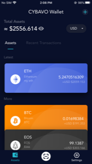
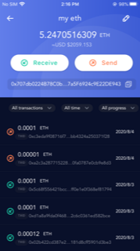

# CYBAVO Wallet SDK for React Native

[](https://npmjs.com/package/@cybavo/react-native-wallet-service)

## Installation

```shell
npm install @cybavo/react-native-wallet-service --save
react-native link @cybavo/react-native-wallet-service
```

```shell
yarn add @cybavo/react-native-wallet-service
react-native link @cybavo/react-native-wallet-service
```

# CYBABO Wallet

Sample app for integrating CYBAVO Wallet App SDK, https://www.cybavo.com/wallet-app-sdk/




## Institutional-grade security for your customers

Protect your customers’ wallets with the same robust technology we use to protect the most important cryptocurrency exchanges. CYBAVO Wallet App SDK allows you to develop your own cryptocurrency wallet, backed by CYBAVO private key protection technology.

### Mobile SDK

Use CYBAVO Wallet App SDK to easily develop secure wallets for your users without having to code any cryptography on your side. Our SDK allows you to perform the most common operations, such as creating a wallet, querying balances and executing cryptocurrency payments.

### Secure key management system

Key management is the most critical part of cryptocurrency storage. CYBAVO Wallet App SDK makes our robust private key storage system available to all of your users. Our unique encryption scheme and a shared responsibility model offers top notch protection for your customer’s keys.

### CYBAVO Security Cloud

Cryptocurrency transactions performed by wallets developed with CYBAVO Wallet App SDK will be shielded by our Security Cloud, ensuring their integrity.

## Complete solution for cryptocurrency wallets

### Cost saving

Leverage your in-house developing team and develop mobile cryptocurrency apps without compromising on security.

### Fast development

Quickly and easily develop cryptocurrency applications using mobile native languages, without having to worry about cryptographic code.

### Full Node maintenance

Leverage CYBAVO Wallet App SDK infrastructure and avoid maintaining a full node for your application.

Feel free to contact us for product inquiries or mail us: info@cybavo.com

# CYBAVO

A group of cybersecurity experts making crypto-currency wallet secure and usable for your daily business operation.

We provide VAULT, wallet, ledger service for cryptocurrency. Trusted by many exchanges and stable-coin ico teams, please feel free to contact us when your company or business need any help in cryptocurrency operation.

# Setup
## Android
1. Clone the source code from GitHub
2. Install the dependencies
   ```
   yarn install
   ```
3. Polyfill NodeJS modules for React-Native  
   ```
   $ yarn add rn-nodeify
   $ rn-nodeify --install --hack
   ```
4. unmark `require('crypto')` in `shim.js`
5. Edit or create `android/local.properties` to config Maven repository URL / credentials provided by CYBAVO
   ```
   cybavo.maven.url=$MAVEN_REPO_URL
   cybavo.maven.username=$MAVEN_REPO_USRENAME
   cybavo.maven.password=$MAVEN_REPO_PASSWORD
   ```
6. Place your `google-services.json` file downloaded from Firebase to `android/app` [(LearnMore)](https://github.com/react-native-community/react-native-google-signin/blob/master/docs/get-config-file.md)
7. Edit `BuildConfig.json` ➜ `GOOGLE_SIGN_IN_WEB_CLI_ID` to your Google sign-in client ID
8. Edit `BuildConfig.json` ➜ `MAIN_ENDPOINT` to point to your Wallet Service endpoont
9. Register your app on CYBAVO WALLET MANAGEMENT system web > Administration > System settings, input `package name` and `Signature keystore SHA1 fingerprint`, follow the instruction to retrieve an `API Code`.
10. Edit `BuildConfig.json` ➜ `MAIN_API_CODE_ANDROID` to fill in your `API Code`
11. Edit `android/app/src/main/res/values/strings.xml` ➜ `MY_FACEBOOK_APP_ID` to fill in your `Facebook app id`
12. Edit `android/app/src/main/res/values/strings.xml` ➜ `MY_LINE_CHANNEL_ID` to fill in your `LINE channel scheme`
13. Perform below command to fix build issues:
   ```
   cp patch/FABGroup.txt node_modules/react-native-paper/src/components/FAB/FABGroup.tsx
   sed -i "" '/minSdkVersion/d' node_modules/react-native-i18n/android/src/main/AndroidManifest.xml
   ./appcenter-pre-build.sh
   sed -i "" 's/compileSdkVersion .*/compileSdkVersion 29/g' node_modules/react-native-twitter-signin/android/build.gradle
   sed -i "" 's/buildToolsVersion .*/buildToolsVersion "28.0.3"/g' node_modules/react-native-twitter-signin/android/build.gradle
   sed -i "" 's/minSdkVersion .*/minSdkVersion 19/g' node_modules/react-native-twitter-signin/android/build.gradle
   sed -i "" 's/targetSdkVersion .*/targetSdkVersion 29/g' node_modules/react-native-twitter-signin/android/build.gradle
   ```
## iOS
1. Clone the source code from GitHub
2. Install the dependencies
   ```
   yarn install
   ```
3. Polyfill NodeJS modules for React-Native  
   ```
   $ yarn add rn-nodeify
   $ rn-nodeify --install --hack
   ```
4. unmark `require('crypto')` in `shim.js`
5. Walkaround for `react-native-twitter-signin`
   ```
   rm -rf node_modules/react-native-twitter-signin/ios/dependencies
   sed -i "" 's/s.dependency "TwitterKit", "~> 3.3"/s.dependency "TwitterKit5"/g' 
   ```
6. Perform below command to fix build issues:
   ```
   cp patch/RCTUIImageViewAnimated.m node_modules/react-native/Libraries/Image/RCTUIImageViewAnimated.m
   cp patch/FABGroup.txt node_modules/react-native-paper/src/components/FAB/FABGroup.tsx
   cp patch/scan_index.txt node_modules/react-native-qrcode-scanner/index.js
   cp patch/RCTCxxBridge.mm node_modules/react-native/React/CxxBridge/RCTCxxBridge.mm
   cp patch/RCTTurboModuleManager.mm node_modules/react-native/ReactCommon/turbomodule/core/platform/ios/RCTTurboModuleManager.mm
   cp patch/default-encoding.js node_modules/parse-asn1/node_modules/pbkdf2/lib/default-encoding.js
   ```
3. Place ssh key requested from CYBAVO to ~/.ssh/ (rename it if nessersary)
5. Run `pod install` in `ios/`
6. Place your `GoogleService-Info.plist` file downloaded from Firebase to `ios/` [(LearnMore)](https://github.com/react-native-community/react-native-google-signin/blob/master/docs/get-config-file.md)
7. Open your project configuration: double-click the project name in the left tree view. Select your app from the TARGETS section, then select the Info tab, and expand the URL Types section. Replace `Identifier` and `URL Schemes` with `CLIENT_ID" and `REVERSED_CLIENT_ID` in your `GoogleService-Info.plist`. [(LearnMore)](https://developers.google.com/identity/sign-in/ios/start-integrating)
8. Replace `MY_FACEBOOK_SIGN_IN_APP_ID` with your `Facebook app id`
9. Replace `MY_LINE_CHANNEL_SCHEME` with your `LINE channel scheme`
9. Replace `MY_GOOGLE_SIGN_IN_WEB_CLI_ID` with your `Google sign-in client ID`
10. Edit `BuildConfig.json` ➜ `GOOGLE_SIGN_IN_WEB_CLI_ID` to your Google sign-in client ID
11. Edit `BuildConfig.json` ➜ `MAIN_ENDPOINT` to point to your Wallet Service endpoont
12. Register your app on CYBAVO WALLET MANAGEMENT system web > Administration > System settings, input `bundle id`, follow the instruction to retrieve an `API Code`.
13. Edit `BuildConfig.json` ➜ `MAIN_API_CODE_IOS` to fill in yout `API Code`
# Push notification
To receive silent push notification of deposit/withdrawal. Please refer to [this](https://rnfirebase.io/messaging/usage) to setup.

# Biometrics Authentication
Biometrics Authentication is optional, it requires futher authentication when sign in and do transaction:

1. Need to verify SMS code when sign in on a new device.
2. If the device don't support biometrics, PIN and SMS code are required when performing transaction.
3. If the device support biometrics, PIN and biometrics authentication are required performing transaction.

## SignInState for Register flow
After user sign in, you may invoke Wallets API. ex. Wallets.getCurrencies() 


   If get `SignInState.NEED_REGISTER_PHONE` init register phone process.

   If get `SignInState.NEED_VERIFY_OTP`, init verify OTP process.

```javascript
 import { WalletSdk, Auth, Wallets } from '@cybavo/react-native-wallet-service';
 
 Auth.addListener(Auth.Events.onSignInStateChanged, signInState => {
      
      if (signInState === Auth.SignInState.NEED_VERIFY_OTP) {
         // Lead user to verify SMS page
      }else if(signInState === Auth.SignInState.NEED_REGISTER_PHONE){
         // Lead user to register phone page
    });
```
## Register phone (NEED_REGISTER_PHONE)

When receive `SignInState.NEED_REGISTER_PHONE`
```javascript
   let countryCode = '+886';
   let fotmattedNationalNumber = '987654321';
   const COOL_TIME = 60;
   const res = await Auth.registerPhoneNumber(
     countryCode,
     fotmattedNationalNumber,
     COOL_TIME
   );
   
   await Auth.verifyOtp(res.actionToken, smsCode);
```
## Register public key

```javascript
   let { biometricsType } = await Wallets.getBiometricsType();
   await Wallets.updateDeviceInfo(); //detect and send biometricsType to server
   if(biometricsType != Wallets.BiometricsType.NONE){ // device support biometrics
      await Wallets.registerPubkey();
   }
```

## Sign in and verify SMS (NEED_VERIFY_OTP)

When receive `SignInState.NEED_VERIFY_OTP`

```javascript
   const COOL_TIME = 60;
   const res = await Wallets.getSmsCode(Wallets.OtpType.SMS_LOGIN_OTP, COOL_TIME);
   //or await Wallets.getLoginSmsCode(COOL_TIME)
   await Auth.verifyOtp(res.actionToken, smsCode);
```
## Biometrics authentication for transaction

There are two versions (SMS and Biometrics) for following transaction API:
* createTransaction
* requestSecureToken
* signRawTx
* increaseTransactionFee
* callAbiFunction
* cancelTransaction
* callAbiFunctionTransaction
* signMessage
* walletConnectSignTypedData
* walletConnectSignTransaction
* walletConnectSignMessage

SMS version has suffix 'Sms', ex. createTransactionSms

Biometrics version has suffix 'Bio', ex. createTransactionBio

### SMS version

If device don't support biometric, make a transaction with PIN secret and SMS code.

```javascript
const { actionToken } = await Wallets.getTransactionSmsCode(COOL_TIME);
//or await Wallets.getSmsCode(Wallets.OtpType.SMS_VERIFY_OTP, COOL_TIME);

result = await Wallets.createTransactionSms(
              actionToken,
              code, //smsCode
              wallet.walletId,
              receiver,
              amount,
              transactionFee,
              description,
              pinSecret,
              extras
          );
```

### Biometrics version

If device support biometric, make a transaction with PIN secret and biometrics authentication prompt.

```javascript
result = await Wallets.createTransactionBio(
              promptMessage,
              cancelButtonText,
              wallet.walletId,
              receiver,
              amount,
              transactionFee,
              description,
              pinSecret,
              extras
          );
```

# WalletConnect
CYBAVO Wallet App SDK has integrated [WalletConnect](https://docs.walletconnect.org/) to support wallet apps connecting with Dapps (Web3 Apps).

1. Following code snippet is the simple usage of how to new a session, approve session request and approve call request

    For further technical specification, please refer to [WalletConnect's official document](https://docs.walletconnect.org/tech-spec)
    ```javascript
    import { WalletConnectSdk } from "@cybavo/react-native-wallet-service";
    const { WalletConnectManager, WalletConnectHelper } = WalletConnectSdk;
    // Establish session, then the callback will receive session request 
    let connectorWrapper = WalletConnectManager.newSession(
            walletConnectUri,
            walletAddress,
            walletId,
            walletClientMeta,
            (error, payload) => {
                sessionRequestCallback(connectorWrapper.getConnector().peerId, error, payload);
            }
          );
    
    let sessionRequestCallback = (peerId, error, payload) => {
        //approve session, then pass the listeners to receive call request and disconnect event
        WalletConnectManager.approveSession(
              peerId,
              {
                accounts: [walletAddress],
                chainId: 1, //main net
              },
              (error: any, payload: any) => {
                    callRequestListener(peerId, error, payload);
              },
              disconnectListener
        )
    }
    let callRequestListener = (peerId, error: any, payload: any) => {
        WalletConnectManager.approveRequest(peerId, response).then(() => {})
    }
    let disconnectListener = (error: any, payload: any) => {}
    ``` 
2. API to support handling call request 

   [Here](https://docs.walletconnect.org/json-rpc-api-methods/ethereum) defined methods that wallet app should implement. 
   We also provided API to handle corresponding methods:
   
   * personal_sign, eth_sign
    ```javascript
   let message = payload.params[0];
   let result = await Wallets.walletConnectSignMessage(
           walletId,
           convertHexToUtf8(message),
           pinSecret
         );
    ```
   * eth_sendTransaction
   
    ```javascript
   let tx = payload.params[0];
   // 1. sign transaction
   let result = await Wallets.walletConnectSignTransaction(
           walletId,
           tx,
           transactionFee,
           pinSecret
         );
   // 2. send signed transaction
   let sendResult = await Wallets.walletConnectSendSignedTransaction(
                walletId,
                result.signedTx
              );
   // return TXID as approve response to the Dapp
   let response = { result: sendResult.txid, id: payload.id };
   await WalletConnectManager.approveRequest(peerId, response);
   
    ```
    * eth_signTypedData
    
    ```javascript
    let message = payload.params[1];
         let result = await Wallets.walletConnectSignTypedData(
           walletId,
           message,
           pinSecret
         );
    let response = { result: '0x' + result.signedTx, id: payload.id };
    await WalletConnectManager.approveRequest(peerId, response);
    ```
    * eth_sendRawTransaction
    
    ```javascript
    let signedTx = params[0];
    let sendResult = await Wallets.walletConnectSendSignedTransaction(
                walletId,
                signedTx
              );
    // return TXID as approve response to the Dapp
    let response = { result: sendResult.txid, id: payload.id };
    await WalletConnectManager.approveRequest(peerId, response);
    ```
   
    * eth_signTransaction
    
    ```javascript
    let tx = payload.params[0];
    let result = await Wallets.walletConnectSignTransaction(
           walletId,
           tx,
           transactionFee,
           pinSecret
         );
     let response = { result: result.signedTx, id: payload.id };
     await WalletConnectManager.approveRequest(peerId, response);
    ```
3. Other supportive API
    * Wallets.walletConnectSync
    
        Check if there're any changes after transactions committed through `Wallets.walletConnectSendSignedTransaction` or `Wallets.sendSignedTx` and perform the updates.

    * Wallets.getWalletConnectApiHistory        
        
        All walletconnect related API will be logged as ApiHistoryItem with vary API Names. Use `Wallets.getWalletConnectApiHistory` to fetch API histories.
        
    * Wallets.cancelWalletConnectTransaction  
    
        Use `Wallets.cancelWalletConnectTransaction` to cancel a pending transaction which sent through `Wallets.walletConnectSendSignedTransaction`.
        
        It's required a higher transaction fee (1.1 times) to replace the original transaction with 0 amount.
   
# Features

- Sign in / Sign up with 3rd-party account system - Google, Apple, LINE
- Wallet Creation / Editing
- Wallet Deposit / Withdrawal
- Transaction History query
- PIN Code configuration: Setup / Change / Recovery
